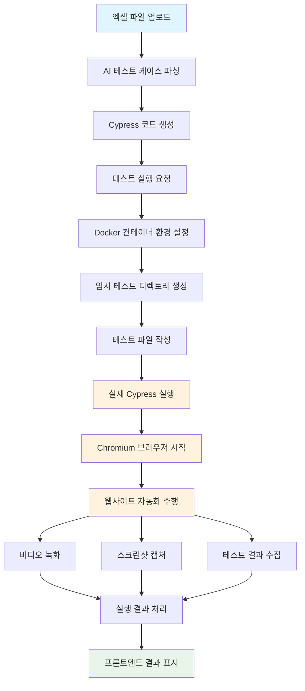
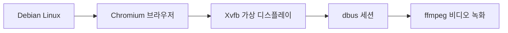
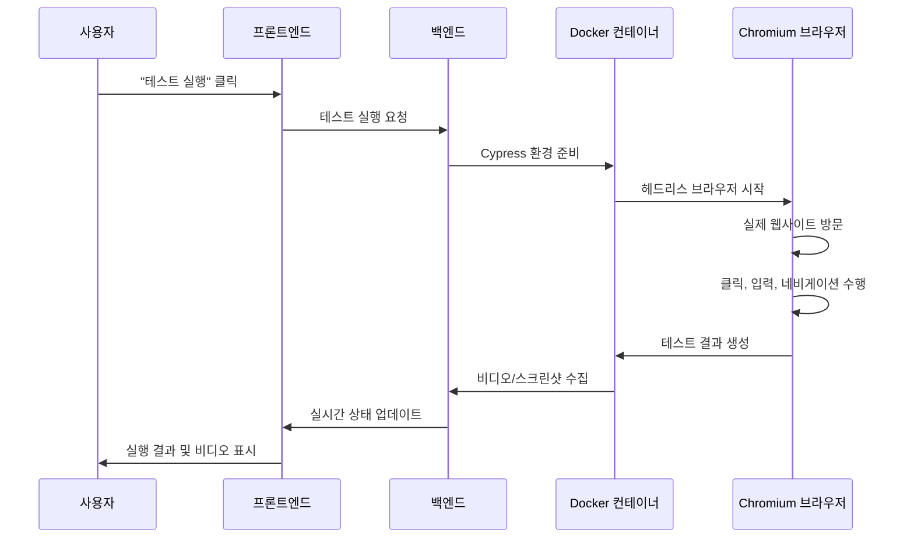

# Testcase Translator

A powerful test automation tool that converts Excel-based test cases into automated Cypress test scripts using AI-powered parsing and browser automation.

## Overview

Testcase Translator helps QA teams and product managers automate their testing workflows by:
- Converting Excel test cases into executable Cypress scripts
- Using Claude AI via Mastra.ai for intelligent test case parsing
- Automatically exploring web pages to generate test scripts
- Providing a user-friendly interface for managing test projects

## Architecture

The project uses a three-tier architecture:
- **Frontend**: React application (port 3000)
- **Backend**: Node.js/TypeScript API server (port 8000)
- **Database**: PostgreSQL (port 5432)

## Getting Started

### Prerequisites
- Docker and Docker Compose
- Node.js 18+ (for local development)
- An Anthropic API key for Claude
- A Mastra.ai API key

### Setup

1. Clone the repository:
```bash
git clone https://github.com/yourusername/testcase-translator.git
cd testcase-translator
```

2. Create a `.env` file based on `.env.example`:
```bash
cp .env.example .env
# Edit .env with your API keys
```

3. Start the application with Docker Compose:
```bash
docker-compose up
```

4. Access the application:
- Frontend: http://localhost:3000
- Backend API: http://localhost:8000
- Database: localhost:5432

## Development

### Task Management
This project uses Task Master for development workflow:
```bash
# View current tasks
task-master list

# Work on a specific task
task-master expand <task-id>

# Update task status
task-master set-status <task-id> <status>
```

### Running Services Individually
```bash
# Frontend development
cd frontend
npm install
npm run dev

# Backend development
cd backend
npm install
npm run dev

# Database
docker-compose up db
```

## Features

1. **URL Validation & HTML Retrieval**: Validates URLs and fetches page content
2. **AI-Powered Excel Parsing**: Uses Claude to understand test scenarios
3. **Dynamic Browser Exploration**: Automated page navigation using Puppeteer
4. **Real-time Updates**: WebSocket-based progress tracking
5. **Cypress Script Generation**: Automated test script creation
6. **Project Management**: Full CRUD operations for test projects

## 테스트 실행 플로우 (Test Execution Flow)

이 시스템은 실제 브라우저 자동화를 통해 **진짜 Cypress 테스트**를 실행합니다.



### 🔄 상세 실행 과정

#### 1. **테스트 환경 구성**


#### 2. **실시간 테스트 실행**


#### 3. **파일 구조 및 결과물**
```
/temp/cypress-executions/{executionId}/
├── cypress.config.js          # 설정 파일
├── package.json               # 의존성
└── cypress/
    ├── e2e/
    │   └── generated-test.cy.js  # AI 생성 테스트
    ├── videos/
    │   └── test-execution.mp4    # 실제 실행 비디오 (10+ MB)
    └── screenshots/
        └── failure-screenshot.png
```

### 🎯 이전 vs 현재 비교

| 항목 | 이전 (시뮬레이션) | 현재 (실제 실행) |
|------|------------------|------------------|
| **비디오** | 1초 플레이스홀더 | 10MB+ 실제 실행 영상 |
| **실행 시간** | 즉시 완료 | 2-5분 실제 브라우저 테스트 |
| **테스트 결과** | 가상 성공 결과 | 실제 웹사이트 기반 통과/실패 |
| **브라우저** | 시뮬레이션 | 실제 Chromium 자동화 |
| **에러 처리** | 가상 에러 | 실제 웹사이트 오류 감지 |

### 🛠️ 기술 스택
- **Docker**: Debian 기반 ARM64 호환 환경
- **Cypress**: 실제 브라우저 자동화 프레임워크
- **Chromium**: 헤드리스 브라우저 엔진
- **Xvfb**: 가상 디스플레이 서버
- **ffmpeg**: 비디오 녹화 및 처리
- **AI (Claude 3.5 Sonnet)**: 지능형 테스트 코드 생성

### 🎥 실행 결과
- **실제 브라우저 비디오**: 테스트 수행 과정을 완전히 녹화
- **실시간 진행 상황**: 프론트엔드에서 10분간 폴링
- **상세한 오류 보고**: 실제 웹사이트 문제 진단
- **스크린샷**: 실패 시점의 실제 화면 캡처

## Contributing

Please read [CONTRIBUTING.md](CONTRIBUTING.md) for details on our code of conduct and the process for submitting pull requests.

## License

This project is licensed under the MIT License - see the [LICENSE](LICENSE) file for details.